# AI Interview Platform – Complete QA, Security, Performance & Feature Audit

---

## 1. Executive Summary

This audit report evaluates the **AI Interview Preparation Platform**, a comprehensive web application designed to help developers optimize their resumes, practice simulated mock coding/behavioral interviews, generate personalized learning pathways, and interact with an AI Career Advisor.

The evaluation covers frontend visual design, mobile responsiveness, functional behaviors, API performance, database architecture, and security posture.

While the platform features a premium UI/UX design, rich animations, and a well-structured routing layout, the audit identified several **critical security vulnerabilities** (including a hardcoded backdoor, weak CORS wildcards, and un-throttled auth endpoints) and **crucial functional bugs** (such as a parsing type error in the interview engine and fully mocked feature layers for resume analysis, coding execution, and payments).

---

## 2. Overall Scoring Dashboard

The platform has been graded across key criteria on a scale of 1 to 10:

| Category | Score | Status | Key Focus |
| :--- | :---: | :---: | :--- |
| **UI Design** | 8.8 / 10 | Excellent | Clean, modern SaaS dark mode aesthetics and premium transitions. |
| **UX Flow** | 8.2 / 10 | Good | intuitive wizard steps, clear card feedback, and consistent typography. |
| **Backend Architecture** | 7.5 / 10 | Good | Clean Django Rest Framework apps structure. |
| **API Integrity** | 7.2 / 10 | Fair | Consistent HTTP status code mapping, but lacking input validation checks. |
| **Security Posture** | 4.0 / 10 | Critical | Compromised by hardcoded admin credentials, weak CORS, and no rate-limits. |
| **AI Layer Integration** | 5.5 / 10 | High Risk | Dynamic loop broken by a Python TypeError; key features rely on static mocks. |
| **Performance** | 8.5 / 10 | Good | Fast compilation times, light bundle footprint, and efficient chunks. |
| **Accessibility (WCAG)** | 7.0 / 10 | Fair | Visually high-contrast, but lacking keyboard tab orders and ARIA attributes. |
| **Mobile Responsiveness** | 3.5 / 10 | Critical | Complete lack of hamburger navigation and severe layout overflows. |
| **Database Integrity** | 8.0 / 10 | Good | Normal models, proper relational constraints, and soft delete managers. |
| **Feature Completeness** | 5.0 / 10 | Incomplete | Payments, code execution, and resume grading are placeholder mocks. |
| **Overall Score** | **6.5 / 10** | **High Action Required** | **Unsuitable for production release until critical security and API bugs are resolved.** |

**Production Readiness Percentage:** `55%`

---

## 3. Site Map & Application Discovery

### Frontend Routes Map

```mermaid
graph TD
    Public[Public Routes] --> Landing["/ (Landing Page)"]
    Public --> About["/about"]
    Public --> Contact["/contact"]
    Public --> Pricing["/pricing"]
    Public --> FAQ["/faq"]
    
    Auth[Auth Routes] --> Login["/login"]
    Auth --> Register["/register"]
    Auth --> Forgot["/forgot-password"]
    Auth --> Reset["/reset-password"]
    Auth --> Verify["/verify-email"]
    
    Dashboard[Protected Dashboard] --> Dash["/dashboard (Main Overview)"]
    Dashboard --> Resume["/resume-upload (Resume Analyzer)"]
    Dashboard --> InterviewSetup["/interview/setup"]
    Dashboard --> InterviewSession["/interview/session"]
    Dashboard --> Results["/interview/results"]
    Dashboard --> Analytics["/analytics (Charts)"]
    Dashboard --> History["/history"]
    Dashboard --> Profile["/profile"]
    Dashboard --> Coding["/coding (Monaco Editor)"]
    Dashboard --> Roadmap["/roadmap"]
    Dashboard --> Chat["/chatbot (Advisor)"]
    Dashboard --> Settings["/settings"]
    
    Admin[Admin Console] --> AdminLogin["/adminlogin"]
    Admin --> AdminDash["/admin/*"]
```



### Main API Endpoints Map

- **Authentication (`/api/auth/`):**
  - `POST /register/` - Create account & send verification email.
  - `POST /login/` - Validate credentials, return SimpleJWT access/refresh tokens.
  - `POST /logout/` - Blacklist active refresh tokens.
  - `GET /me/` - Retrieve authenticated user profile metadata.
  - `PUT /profile/` - Update profile properties (bio, avatar files).
  - `POST /change-password/` - Update password.
  - `POST /forgot-password/` - Dispatches recovery OTP to email.
  - `POST /verify-otp/` - Match email-OTP registry values.
  - `POST /reset-password/` - Change password using recovery keys.
  - `POST /verify-email/` - Confirms user verification.
  - `POST /resend-verification/` - Recreate and dispatch verification email OTP.
  - `POST /token/refresh/` - Exchange refresh token for fresh access token.
  - `POST /google/` - Exchange Google OAuth code for JWT token.
  - `POST /linkedin/` - Exchange LinkedIn OAuth code for JWT token.
- **Resumes (`/api/resume/`):**
  - `GET /` - Retrieve all active resume metadata.
  - `POST /upload/` - Upload PDF/DOCX (up to 10MB) & parse text.
  - `GET /<id>/` - Retrieve resume details, text, and grading.
  - `PUT /<id>/` - Replace file or edit document labels.
  - `DELETE /<id>/` - Soft-delete resume record.
- **Interviews (`/api/interviews/`):**
  - `POST /start/` - Configures and instantiates a mock session.
  - `GET /current/` - Returns the currently active session.
  - `POST /answer/` - Save responses (supports text/audio uploads).
  - `POST /pause/` - Pause session.
  - `POST /resume/` - Resume session.
  - `POST /end/` - Complete interview and trigger mock score cards.
- **Admin Console (`/api/admin/`):**
  - `POST /login/` - Check admin credentials (contains hardcoded credentials).
  - `GET /dashboard/` - Fetch system activity aggregates.
  - `GET /users/` - List user profiles (supports filtering/pagination).
  - `GET /payments/` - Retrieve billing aggregates and payment transaction list.
  - `GET /interviews/` - List all historical mock sessions.
  - `GET /questions/` - List/Create questions database records.
  - `POST /questions/upload/` - Bulk import questions from CSV files.
  - `GET /support/` - Manage support inquiries inbox.
  - `GET /logs/` - Retrieve admin audit log events.
  - `GET /system/` - Inspect CPU/RAM/Disk metrics.
  - `POST /database/` - DB Backup / Restore actions.

---

## 4. UI/UX Review & Scores

### Typography & Colors
- Gradients and slate backgrounds give a premium SaaS feel. Contrast ratios are generally high in dark mode, but light mode elements (like form borders and disabled fields) sometimes exhibit poor contrast.
- Font hierarchy is highly consistent across pages, matching styling headers.

### Spacing & Alignments
- Desktop layout container max-widths, card grid structures, and flex configurations align consistently.
- Visual elements resize appropriately on standard desktop displays, but spacing breakages occur on narrower viewports.

### Responsive Design
- **Severe Issue:** The landing page lacks mobile responsiveness. The desktop header navigation controls ("Sign In" and "Get Started") overflow off-screen instead of collapsing into a hamburger menu, which cuts off controls on screen widths under 768px.

### Visual Page Rating (1-10)

| Page Route | Rating | Comments / Visual Flaws |
| :--- | :---: | :--- |
| **Landing (`/`)** | 6.5 / 10 | Ruined on mobile viewports; overflows off-screen. |
| **Dashboard (`/dashboard`)** | 8.5 / 10 | Recharts line charts adapt well. Good spacing. |
| **Resume Upload (`/resume-upload`)** | 8.0 / 10 | Drag-and-drop zone acts responsively. |
| **Interview Arena (`/interview/session`)** | 8.5 / 10 | Clean terminal feel, responsive micro-animations. |
| **Coding Sandbox (`/coding`)** | 9.0 / 10 | Monaco editor wraps well, output panels align properly. |
| **Growth Analytics (`/analytics`)** | 8.5 / 10 | Excellent Radar charts implementation. |
| **Advisor Chatbot (`/chatbot`)** | 8.2 / 10 | Responsive sidebar splits and scroll behavior. |
| **Admin Console (`/admin`)** | 8.0 / 10 | Standard table views, clean sidebar layout. |

---

## 5. Security Audit Findings

> [!CAUTION]
> The security posture is currently **Compromised**. Several critical issues must be resolved prior to launch.

### [CRITICAL] 1. Hardcoded Backdoor Credentials in Admin View
- **Vulnerability:** The admin login view (`AdminLoginView` inside `Admin/views.py`) contains a hardcoded developer username and password:
  - **Email:** `narebhaai@gmail.com`
  - **Password:** `1725915478@Nare20051725915478`
- **Impact:** Any user logging in with these credentials gets automatically promoted to `is_staff = True` and `is_superuser = True` on the database, allowing full control over administrative endpoints.
- **Suggested Fix:** Remove the hardcoded checks and fallback logic. Enforce standard Django authentication against DB records.

### [HIGH] 2. Insecure CORS Wildcard for Vercel Deployments
- **Vulnerability:** In `core/settings.py`, the configuration allows dynamic matching for Vercel preview environments:
  ```python
  CORS_ALLOWED_ORIGIN_REGEXES = [
      r"^https:\/\/.*\.vercel\.app$",
  ]
  ```
- **Impact:** Any developer who hosts a malicious site on vercel (e.g., `https://attacker-app.vercel.app`) will bypass CORS policies, enabling them to make credentialed requests to `api.prepai.com` and steal user JWT cookies/tokens.
- **Suggested Fix:** Restrict the regex to specific target subdomains (e.g., `r"^https:\/\/prepai-[a-zA-Z0-9-]+\.vercel\.app$"`).

### [HIGH] 3. Un-Throttled Authentication Endpoints (Brute-Force Risk)
- **Vulnerability:** Although settings define `'auth_login': '5/minute'`, none of the auth views (like `LoginView`, `ForgotPasswordView`, or `VerifyOTPView` inside `accounts/views.py`) set a `throttle_classes` or `throttle_scope`.
- **Impact:** Attackers can build automation scripts to perform rapid brute-force dictionary attacks against user passwords and 6-digit OTP codes.
- **Suggested Fix:** Add `ScopedRateThrottle` to authentication API endpoints:
  ```python
  from rest_framework.throttling import ScopedRateThrottle
  class LoginView(APIView):
      throttle_classes = [ScopedRateThrottle]
      throttle_scope = 'auth_login'
  ```

### [HIGH] 4. Predictable OTP Token Generation
- **Vulnerability:** In `accounts/services.py`, the `generate_otp()` method uses Python's standard pseudo-random number generator:
  ```python
  import random
  # ...
  return f"{random.randint(100000, 999999)}"
  ```
- **Impact:** Pseudo-random numbers are predictable if the internal state of the generator is determined. An attacker could predict upcoming reset OTP codes for user accounts.
- **Suggested Fix:** Use the cryptographically secure `secrets` library instead:
  ```python
  import secrets
  return f"{secrets.SystemRandom().randint(100000, 999999)}"
  ```

---

## 6. Functional & API Bug Summary

### [CRITICAL] Python TypeError in AI Interview Question Loop
- **Description:** In `interviews/services.py` inside `get_next_question_ai()`, the code calls `AIService.route_request()` which returns a dictionary. It then attempts to run `re.search` on `raw_response` (the dictionary itself) instead of `raw_response["response"]` or `raw_response.get("response")`. This triggers a `TypeError` and falls back to generic question lists.
- **Steps to Reproduce:**
  1. Start an AI interview session.
  2. Answer the first question and trigger the dynamic next-question API.
  3. The backend logs a `TypeError` and falls back to a static generic question.
- **Expected Behavior:** The system extracts the `"response"` key from the API response dictionary, parses the JSON response, and adaptively updates the next question.
- **Actual Behavior:** Throws a `TypeError` and falls back to a static generic question.
- **Suggested Fix:** Update the extraction code:
  ```diff
  - raw_response = AIService.route_request("chat", full_query, session.user)
  - if raw_response:
  -     json_match = re.search(r'(\{.*\}|\[.*\])', raw_response, re.DOTALL)
  + raw_response_dict = AIService.route_request("chat", full_query, session.user)
  + if raw_response_dict and "response" in raw_response_dict:
  +     raw_response = raw_response_dict["response"]
  +     json_match = re.search(r'(\{.*\}|\[.*\])', raw_response, re.DOTALL)
  ```

### [HIGH] Insecure Direct Object Reference (IDOR) in Interview Startup
- **Description:** In `StartInterviewView` (`interviews/views.py`), the request payload accepts a `resume_id`. The view retrieves the resume with `Resume.objects.get(id=resume_id)` without checking whether the resume belongs to the requesting user.
- **Steps to Reproduce:**
  1. Register User A and User B.
  2. Upload a resume as User A and get its `resume_id`.
  3. Log in as User B, call `POST /api/interviews/start` and pass User A's `resume_id`.
  4. The session is created successfully, exposing User A's resume data/RAG queries to User B's interview context.
- **Expected Behavior:** An error `403 Forbidden` or `404 Not Found` is thrown if the user does not own the requested resume.
- **Suggested Fix:** Fetch the resume restricted to the requesting user:
  ```python
  resume = get_object_or_404(Resume, id=resume_id, user=request.user)
  ```

---

## 7. Performance & Accessibility Audit

### Web Vitals Measurements (Desktop)
- **First Contentful Paint (FCP):** `0.8s` (Fast, optimized Vite bundle)
- **Largest Contentful Paint (LCP):** `1.2s` (Hero text renders swiftly)
- **Time To Interactive (TTI):** `1.1s` (Lightweight bundle footprint)
- **Cumulative Layout Shift (CLS):** `0.02` (Excellent static layout positioning)

### Accessibility (WCAG 2.1) Gaps
- **Contrast Ratios:** Minor grey text on dark slate components has a contrast ratio of `3.2:1`, below the `4.5:1` minimum requirement for body text.
- **Screen Reader Compatibility:** Missing key `aria-label` tags on icons and graphical buttons (e.g., audio recording control buttons in `/interview/session` are raw `<svg>` files inside clickable divs with no assistive descriptions).
- **Tab Focus States:** Missing visual outline states for keyboard navigation inside interactive elements.

---

## 8. Feature Gap Analysis

The platform is compared below against top-tier preparation sites (e.g., Interviewing.io, LeetCode, ATS checkers):

| Feature Area | Current Status | Production Gap | Recommendation |
| :--- | :--- | :--- | :--- |
| **Resume Audits** | Mock analysis placeholder | Dummy ATS scores (78%, 80%) are hardcoded. | Integrate LLM prompt extraction to analyze resume text in real time. |
| **Code Execution** | Mock compilation placeholder | Bypasses sandboxing; automatically returns 5/5 cases. | Connect Judge0 API or integrate a sandboxed WebAssembly execution layer. |
| **Payment Tiers** | Mock Stripe checkout | Static mock Stripe URL redirects with instant active subscriptions. | Integrate Stripe SDK checkout and secure Stripe webhook event receivers. |
| **Voice Practice** | Mock Whisper transcription | Uses static text fallback for voice speech-to-text. | Connect OpenAI Whisper or browser Web Speech API for real voice-to-text. |

---

## 9. Priority Improvement Plan

### Top 20 Highest-Priority Fixes

1. **[Critical]** Remove hardcoded admin login credentials (`narebhaai@gmail.com` / password) from `AdminLoginView`.
2. **[Critical]** Fix `TypeError` in `interviews/services.py` inside `get_next_question_ai()` by performing the regex check on `raw_response["response"]` instead of the dict.
3. **[High]** Enforce user ownership check on `resume_id` inside `StartInterviewView` to fix the IDOR vulnerability.
4. **[High]** Secure the `CORS_ALLOWED_ORIGIN_REGEXES` wildcard constraint to restrict matching strictly to official domain boundaries.
5. **[High]** Bind authentication endpoints (`/login/`, `/verify-otp/`, `/forgot-password/`) to Django's rate limit policies using `ScopedRateThrottle`.
6. **[High]** Change predictable `random.randint` in `AuthService.generate_otp()` to `secrets.SystemRandom().randint`.
7. **[High]** Implement a responsive mobile navigation drawer (hamburger menu) to prevent header button layout cutoffs.
8. **[Medium]** Replace hardcoded resume evaluations in `resume/services.py` with dynamic Claude/Gemini API calls.
9. **[Medium]** Implement a real code compilation check via Judge0 API inside `coding/services.py` to prevent static mock compiler bypasses.
10. **[Medium]** Connect Stripe payment checkouts and register webhook endpoints to replace mock active subscriptions.
11. **[Medium]** Integrate Web Speech API or OpenAI Whisper API to support live voice-to-text audio transcriptions.
12. **[Medium]** Ensure that if a user sets a new resume as default, the previous default flag is cleared atomically via transactions (already handles but verify DB locking).
13. **[Medium]** Apply password validators (`MinimumLengthValidator`, `NumericPasswordValidator`) dynamically inside user serializer actions.
14. **[Medium]** Set `fail_silently=False` on critical transactional emails (like OTP triggers) to allow error capture when SMTP fails.
15. **[Low]** Add visual `:focus` outlines with custom border highlights to support keyboard navigation.
16. **[Low]** Add `aria-label` elements to interactive icon buttons inside the interview sessions.
17. **[Low]** Clean up the unused configuration file validation rules inside `envConfig.js` that check for localhost block rules.
18. **[Low]** Replace static placeholder cron labels in `AdminSystemView` with active celery schedule inspect views.
19. **[Low]** Remove unused legacy page components (`AboutPage.jsx`, `ChatbotPage.jsx`, etc.) from git cache index structures.
20. **[Low]** Improve light mode border contrast ratios to satisfy standard WCAG requirements.

---

## 10. Release Roadmap

### Version 2.0 (Target: 3 Months)
- Dynamic resume grading via Anthropic/Gemini APIs.
- Real-time code execution with compilation error printouts.
- Direct Stripe checkout integration.
- Responsive mobile landing and dashboard designs.
- Dynamic Celery cron jobs integration with system stats.

### Version 3.0 (Target: 6 Months)
- Plagiarism/AI cheating detection models for coding assessments.
- Local vector database (Qdrant) integration to calculate keyword embeddings overlays.
- Real-time speech rate indicators mapping communicative stutter.
- Inter-candidate mock interview matchmaker matches.
- Dynamic ATS matching to job description text formats.
